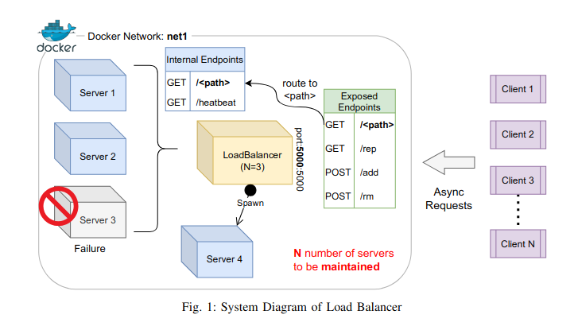
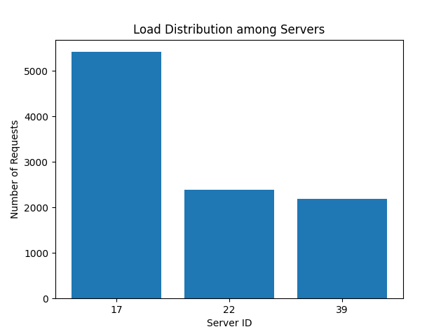

# Custom Load Balancer
<p align="center">
      <br><strong>Overview</strong>
</p>

# Overview

A load balancer routes the requests coming from several clients asynchronously among several servers so that the load is nearly evenly distributed among them. In order to scale a particular service with increasing clients, load balancers are used to manage multiple replicas of the service to improve resource utilization and throughput. In the real world, there are various use cases of such constructs in distributed caching systems, distributed database management systems, network traffic systems, etc. To efficiently distribute the requests coming from the clients, a load balancer uses a consistent hashing data structure.The load balancer is exposed to the clients through the APIs shown in the diagram (details on the APIs are given further). There should always be N servers present to handle the requests. In the event of failure, new replicas of the server will be spawned by the load balancer to handle the requests.

# SERVER
A simple web server that accepts HTTP requests on port 5000 in the below endpoints.
### Endpoints

1. **Endpoint: /home (Method: GET)**
   - Returns a string with a unique identifier, distinguishing among replicated server containers.
   - Example Response JSON:
     ```json
     {
       "message": "Hello from Server: [ID]",
       "status": "successful"
     }
     ```
   - Response Code: 200

2. **Endpoint: /heartbeat (Method: GET)**
   - Sends heartbeat responses upon request. Used by the load balancer to identify container failures.
   - Example Response: [EMPTY]
   - Response Code: 200

## Dockerfile

To containerize the server as an image and make it deployable, a Dockerfile is provided.

### Instructions

### Usage
From the root folder 

```bash
# Build Docker image
docker build -t server-image ./Server

docker build -t loadbalancer ./loadBalancer

# Run Docker container
docker run --network my_network -p 5000:5000 --privileged=true -v /var/run/docker.sock:/var/run/docker.sock -it loadbalancer

```


# Consistent Hash Map 

<p align="center">
      <br><strong>Circular structure of the hash map</strong>
</p>


### Implementation Details

- Two client requests may be mapped to the same slot in the hash map. However, if there is a conflict between two server instances, Quadratic probing is applied to find the next suitable slot.
- Server containers and virtual servers are distinct concepts. Server containers are the number of containers the load balancer manages to handle requests. A virtual server is a theoretical concept that repeats the location of server containers in the consistent hash, aiding better load distribution in case of failure. Virtual servers are not directly tied to the actual number of server containers.


### Hash Functions

1. **Request Mapping Hash Function (H(i)):** `i^2 + 2i + 17`
2. **Virtual Server Mapping Hash Function (Φ(i, j)):** `i^2 + j^2 + 2j + 25`

### Handling Conflicts

In case of conflicts between server instances, Quadratic probing is used to locate the next suitable slot in the hash map.

# Load Balancer Container

The load balancer container utilizes a consistent hashing data structure to manage a set of N web server containers. The load balancer provides HTTP endpoints for configuring and checking the status of the managed web server replicas. The goal is to evenly distribute the client requests across available replicas and maintain N replicas, even in the case of failures.

## Endpoints

1. **Endpoint (/rep, method=GET):**
   - Returns the status of the replicas managed by the load balancer.
   - Example Response:
     ```json
     {
       "message": {
         "N": 3,
         "replicas": ["Server 1", "Server 2", "Server 3"]
       },
       "status": "successful"
     }
     ```
     Response Code: 200

2. **Endpoint (/add, method=POST):**
   - Adds new server instances to scale up with increasing client numbers.
   - Expects a JSON payload with the number of new instances and their preferred hostnames.
   - Example Request:
     ```json
     {
       "n": 4,
       "hostnames": ["S5", "S4", "S10", "S11"]
     }
     ```
   - Example Response:
     ```json
     {
       "message": {
         "N": 7,
         "replicas": ["Server 1", "Server 2", "Server 3", "S5", "S4", "S10", "S11"]
       },
       "status": "successful"
     }
     ```
     Response Code: 200
   - Handles simple sanity checks on the request payload.

3. **Endpoint (/rm, method=DELETE):**
   - Removes server instances to scale down with decreasing client numbers or for system maintenance.
   - Expects a JSON payload with the number of instances to be removed and their preferred hostnames.
   - Example Request:
     ```json
     {
       "n": 3,
       "hostnames": ["S5", "S4"]
     }
     ```
   - Example Response:
     ```json
     {
       "message": {
         "N": 4,
         "replicas": ["Server 1", "Server 3", "S10", "S11"]
       },
       "status": "successful"
     }
     ```
     Response Code: 200
   - Handles simple sanity checks on the request payload.

4. **Endpoint (/<path>, method=GET):**
   - Routes the request to a server replica as scheduled by the consistent hashing algorithm.
   - Requesting an endpoint not registered with the web server will result in an error.
   - Example Response:
     ```json
     {
       "message": "<Error> '/other' endpoint does not exist in server replicas",
       "status": "failure"
     }
     ```
     Response Code: 400

## Dockerization

This Folder includes a Dockerfile to containerize the load balancer. Additionally, a docker-compose file and a Makefile are provided to simplify the deployment of the entire stack in an Ubuntu environment. The default values for the load balancer container parameters are mentioned below.

## Default parameters 

- **Number of Server Containers managed by the load balancer (N):** 3
- **Total number of slots in the consistent hash map (#slots):** 512
- **Number of virtual servers for each server container (K):** log(512) = 9


# Analysis

### We ran 10000 requests on the load-balancer and here are the results

<p align="center">
      <br><strong>Initial 3 servers</strong>
</p>

### The next few are the analysis results when the number of servers are increased from 2 to 6. 

<p align="center">
      <br><strong>2 Servers</strong>
</p>
<p align="center">
      <br><strong>3 Servers</strong>
</p>
<p align="center">
      <br><strong>4 Servers</strong>
</p>
<p align="center">
      <br><strong>5 Servers</strong>
</p>
<p align="center">
      <br><strong>6 Servers</strong>
</p>

### Finally, the average load of the servers at each run, when the number of Servers are inceased from 2 to 6.
<p align="center">
      <br><strong>Fig. A2</strong>
</p>

### Line chart for another run 
<p align="center">
      <br><strong>Line Chart</strong>
</p>


## After using a different hash function as follows : 

1. **Request Mapping Hash Function (H(i)):** `i^2 + 2i + 199`
2. **Virtual Server Mapping Hash Function (Φ(i, j)):** `i^2 + j^2 + 2*i*j + 199`

## The following analysis was found : 
<p align="center">
      <br><strong>Analysis 1(Average load across 3 servers)</strong>
</p>

<p align="center">
      <br><strong>Analysis 2 Bar(Average load across 6 servers)</strong>
</p>

<p align="center">
      <br><strong>Analysis 2 Line Chart(Average load across 6 servers)</strong>
</p>


## Explanation : 


## Verifying different Endpoints : 
#### Initial Configuration of 3 servers is followed. 

```
xeno@xeno-Distributed-Systems-Assignment-1-Customizable-Load-Balancer/Analysis$ python3 endpoints_test.py 
Endpoint /rep:
Response Code:  200
Response JSON:  {'message': {'N': 3, 'replicas': ['server18', 'server33', 'server47']}, 'status': 'successful'}

Endpoint /add:
Request Payload:  {'n': 5, 'hostnames': ['S5', 'S4', 'S10', 'S11']}
Response Payload:  {'message': {'N': 8, 'replicas': ['server18', 'server33', 'server47', 'S5', 'S4', 'S10', 'S11', 'server50']}, 'status': 'successful'}

Endpoint /rm:
Request Payload:  {'n': 3, 'hostnames': ['S5', 'S4']}
Response Payload :  {'message': {'replicas': ['server18', 'server47', 'S10', 'S11', 'server50']}, 'status': 'success'}

Endpoint /home:
Request URL: http://localhost:5000/home
Response : {'message': 'Hello from Server: [29]', 'status': 'successfull'}
```

<p align="center">
      <br><strong>Test</strong>
</p>


Server Respawning Can be seen here : 
<p align="center">
      <br><strong>Spawning</strong>
</p>


## Hash Function changes and run : 


# Assumptions and Clarifications 


For Running the LoadBalancer, in the root dorectory, run command : 
```
make start
```

RUNNING : 
1. go to Server/  => then run :          docker build -t serverimage . 
2. go to loadBalancer/ =>  then run :    docker build -t loadbalancer 
3. run the command : docker run -p 5000:5000 --privileged=true -v /var/run/docker.sock:/var/run/docker.sock -it loadbalancer
